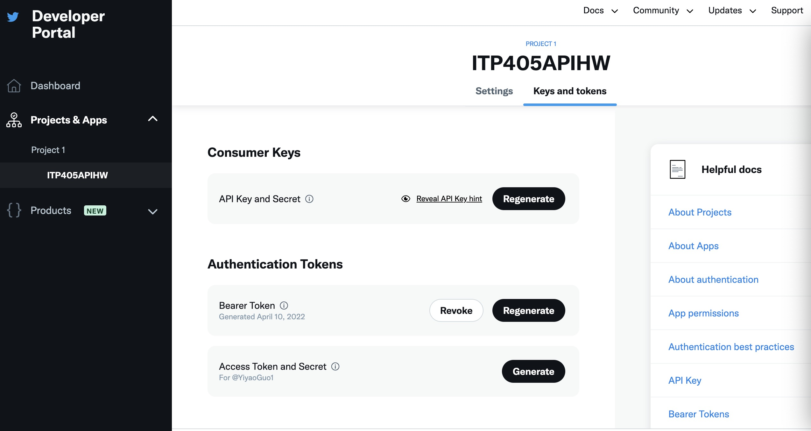
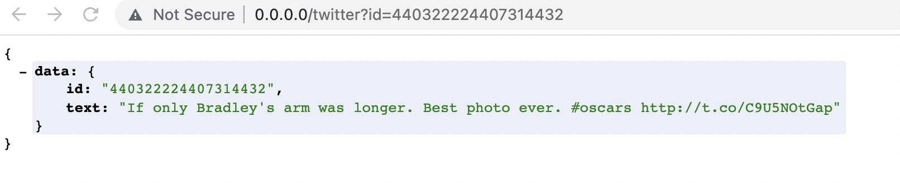
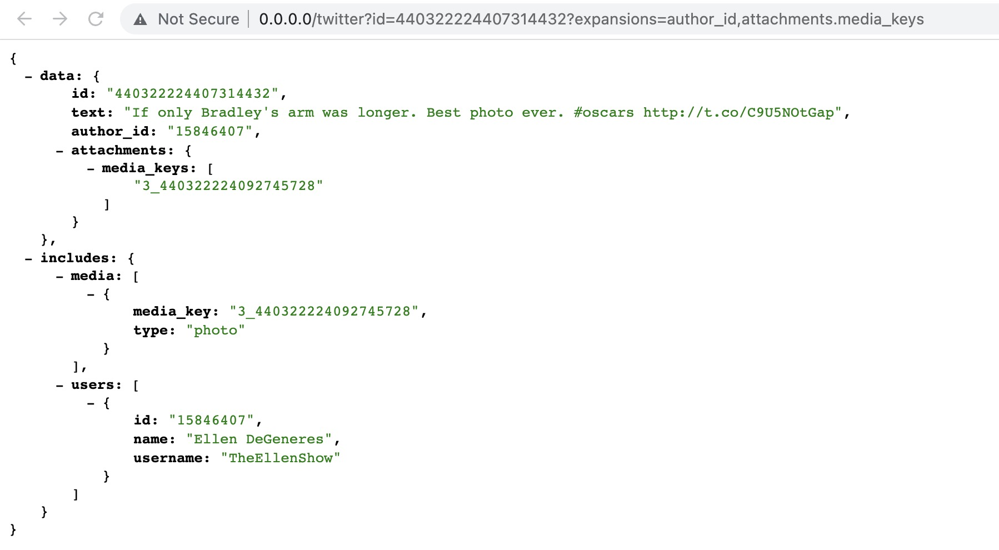
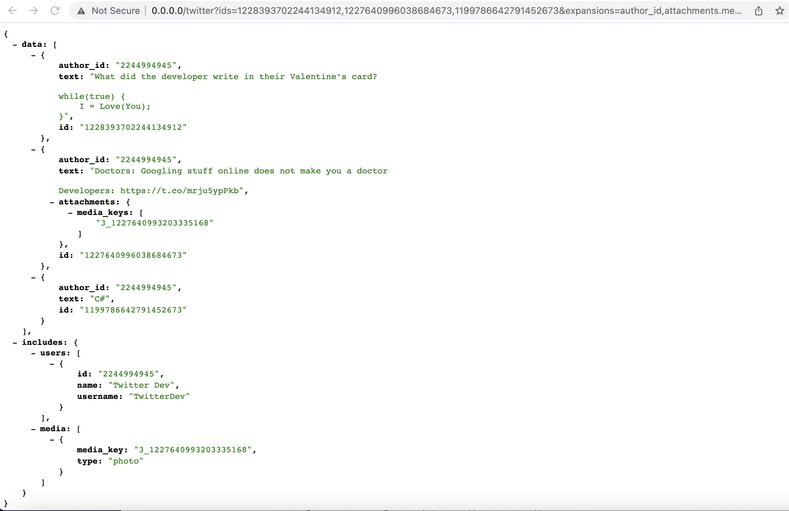
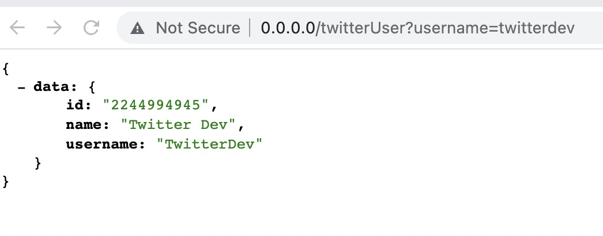
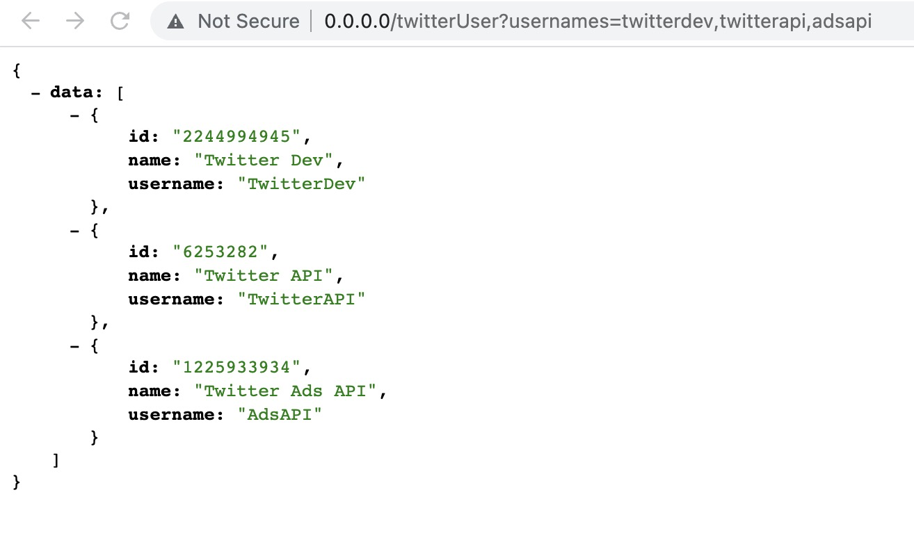
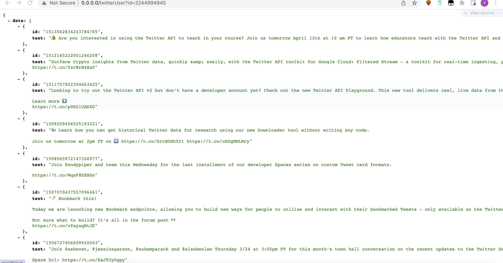

## Twitter API v2

Twitter API allows programmers to retrieve Twitter data including tweets, user profiles as well as post Tweets without actually logging in Twitter

### Getting Started to the endpoints

1. Log into your Twitter account in https://developer.twitter.com/
   
2. Hit the sign up button on the right side and get approved for Twitter devloper portal
3. Create an app in Developer Portal
4. Once app is created, you will receive API key, API secret and bearer token. Keep them in a safe place
5. If keys are not recorded at the first time, access the developer portal and regenerate new ones
   
6. Incorporating Bearer Token in headers when using

For more information, visit https://developer.twitter.com/apitools/

### GET tweet objects

#### Get a specific tweet by tweet id

```
Route::get('/twitter', function(Request $request) {
    $id = $request->query('id');
    return Http::withHeaders([
        'Authorization' => "Bearer " . env('TWITTER_BEARER_TOKEN'),
    ])
    ->get("https://api.twitter.com/2/tweets/$id")
    ->json();
});
```

Example:


#### Including the expansions attributes in a call

```
Route::get('/twitter', function(Request $request) {
    $id = $request->query('id');
    $expansions = $request->query('expansions');
    return Http::withHeaders([
        'Authorization' => "Bearer " . env('TWITTER_BEARER_TOKEN'),
    ])
    ->get("https://api.twitter.com/2/tweets/$id$expansions")
    ->json();
});
```

Example:


Options that could be passed into expansions field:
attachments.poll_ids, attachments.media_keys, author_id, entities.mentions.username, geo.place_id, in_reply_to_user_id, referenced_tweets.id, referenced_tweets.id.author_id

Other attributes that could be added to a search other than expansions:
Time when the user was created: user.fields=created_at
Time when the tweet was post: tweet.fields=created_at

### Getting multiple tweets by tweet ids

```
Route::get('/twitter', function(Request $request) {
    $ids = $request->query('ids');
    $expansions = $request->query('expansions');
        return Http::withHeaders([
            'Authorization' => "Bearer " . env('TWITTER_BEARER_TOKEN'),
        ])
        ->get("https://api.twitter.com/2/tweets?ids=$ids&expansions=$expansions")
        ->json();
    }
```

Similar to a single tweet's call, but needs to specify fields' name in the code.

Example:


### Get user id by username(s)

```
Route::get('/twitterUser', function(Request $request) {
    $username = $request->query('username');
    return Http::withHeaders([
        'Authorization' => "Bearer " . env('TWITTER_BEARER_TOKEN'),
    ])
    // for single user
    ->get("https://api.twitter.com/2/users/by/username/$username")
    // for multiple users
//  ->get("https://api.twitter.com/2/users/by?usernames=$usernames")
    ->json();
});
```

Example:



### Get tweets by user id

```
Route::get('/twitterUser', function(Request $request) {
    $id = $request->query('id');
    return Http::withHeaders([
        'Authorization' => "Bearer " . env('TWITTER_BEARER_TOKEN'),
    ])
    ->get("https://api.twitter.com/2/users/$id/tweets")
    ->json();
```

Example:

